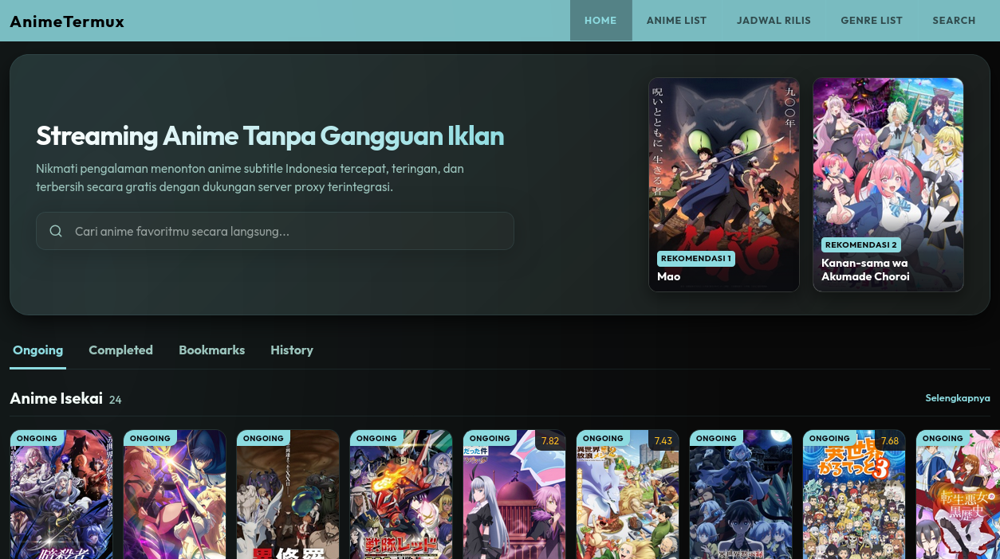
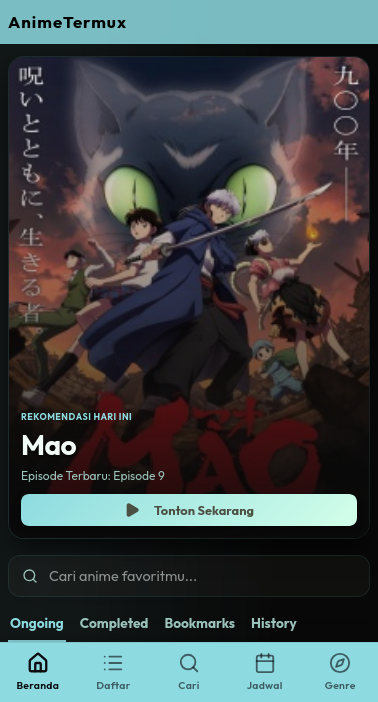

<h1 align="center">
  AnimeTermux
</h1>

<h3 align="center">
Aplikasi web streaming anime yang dirancang untuk berjalan di jaringan lokal maupun jarak jauh (Mendukung Root & Non-Root).
</h3>

<p align="center">
  
  
  
  <br>
  <a href="#dukungan-utama-linux-android-termux"></a>
  <a href="#dukungan-alternatif-macos-windows-wsl"></a>
  <a href="#dukungan-utama-linux-android-termux"></a>
  <a href="#dukungan-alternatif-macos-windows-wsl"></a>
  <a href="#dukungan-alternatif-macos-windows-wsl"></a>
</p>

<p align="center">
  
  
</p>

## Daftar Isi

- [Fitur Utama](#fitur-utama)
- [Instalasi](#instalasi)
  - [Dukungan Utama: Linux, Android (Termux)](#dukungan-utama-linux-android-termux)
  - [Dukungan Alternatif: MacOS, Windows, iOS, FreeBSD, Steam Deck](#dukungan-alternatif-macos-windows-wsl-ios-freebsd-steam-deck)
- [Dependensi](#dependensi)
- [Konfigurasi Lanjutan](#konfigurasi-lanjutan)
- [Struktur Proyek](#struktur-proyek)
- [FAQ](#faq)
- [Penyangkalan](#penyangkalan)

## Fitur Utama

- **Antarmuka Responsif:** Dibangun menggunakan React dan Vite, memberikan tata letak padat dan elegan untuk desktop dan mobile.
- **Smart Cache System (SWR):** Menggunakan cache Stale-While-Revalidate untuk mengurangi waktu tunggu (loading) secara drastis saat trafik sedang tinggi.
- **Sistem Rekomendasi Ganda:** Rekomendasi anime cerdas berdasarkan riwayat tontonan dan kunjungan Anda.
- **Integrasi Bot Telegram:** Dilengkapi bot Telegram untuk notifikasi rilis terbaru dan pengelolaan jarak jauh.
- **Tunneling Otomatis:** Mendukung Cloudflare Tunnels dan Ngrok secara bawaan.
- **Launcher Pintar:** Skrip Bash (`run.sh`) untuk instalasi dependensi otomatis dan manajemen background proses.

<details><summary><b>Keunggulan Teknis Tersembunyi</b></summary>

- **Bot Telegram Asinkron Super Cepat:** Menggunakan *python-telegram-bot* dengan arsitektur *Async* (Application, CommandHandler). Dilengkapi algoritma yang men-*scrape* komik/manga (*komiku.org*) dan mengunduh video TikTok tanpa watermark (*tikwm.com*) secara langsung ke chat Telegram Anda! Semua *file_id* di-*cache* rapi menggunakan SQLite agar *loading* instan.
- **Preloader Multi-Threading Ganas:** Skrip `preloader.py` ditenagai oleh 50-100 *Thread Pool Executor* paralel. Mampu melakukan *scraping* puluhan ribu data anime secara simultan dalam hitungan detik. *RouteManager* yang terintegrasi akan memeriksa Telegram *sendChatAction* secara dinamis untuk mencegah *rate-limit* (pencekikan server) saat mengunggah jutaan *thumbnail*.
- **Logika Rekomendasi Pintar (Frontend):** Tidak sekadar mengacak anime! Algoritma React menghitung "Bobot Kesukaan": Riwayat Tontonan (1.0x), Kunjungan (0.4x), dan Bookmark (0.8x) untuk menyajikan *Hero Banner* paling relevan. Ia juga dirancang untuk tidak akan pernah menampilkan *genre* khusus dewasa secara publik.
- **Detektor Eksekusi Bash:** Skrip `run.sh` secara mandiri dapat mendeteksi apabila ia dijalankan di dalam Termux Android. Ia akan secara otomatis mengaktifkan `termux-wake-lock` untuk mencegah sistem operasi Android membunuh proses *web server* ketika layar redup.
- **Zero-Waste Installation Bypass:** Skrip `run.sh` dan `run.bat` didesain cerdas untuk mendeteksi folder *build* (`frontend/dist`). Jika *website* sudah pernah di-*build* (seperti pada lingkungan produksi Terkompilasi), ia akan mengabaikan instalasi Node.js, `npm install`, dan `esbuild`, sehingga memangkas waktu nyala server dan hemat kuota ratusan Megabyte.
- **Maximum Lazy Loading & Code Splitting:** Frontend React mengimplementasikan utilitas `React.lazy()` dan `<Suspense>`. Arsitektur ini memecah bundel *Javascript* yang masif menjadi *chunk-chunk* mikro. Jika pengguna cuma mengakses *Home*, sistem tidak akan pernah mengunduh modul *Detail* atau *Watch*! Ditambah seluruh aset gambar dan *Iframe* dipersenjatai atribut `loading="lazy"` agar performa *mobile* tetap mulus.
- **Smart Responsive Layout:** Integrasi penataan posisi UI dinamis antara ukuran PC dan Desktop yang bersih. Pada lingkungan PC, *Search bar* dioptimalkan menyatu dengan Hero Banner, sementara di lingkungan layar *Mobile* ia terpisah manis dengan struktur *compact* bergaya *Webtoon*.

</details>

> [!NOTE]
> **Kompatibilitas Hak Akses:** Aplikasi ini mendukung penuh penjalangan menggunakan akun biasa (**Non-Root**) maupun administrator (**Root**). Skrip launcher [run.sh](file:///home/uznbt/Destop/animetermux/run.sh) akan otomatis menyesuaikan port server (menggunakan port `80` jika dijalankan sebagai Root, atau port `8080` jika dijalankan sebagai Non-Root) serta mengatur izin Nginx secara otomatis.

## Dukungan Utama: Linux, Android

*Platform ini memiliki dukungan paling stabil dan sangat direkomendasikan.*

<details><summary><b>Linux (Ubuntu/Debian/Fedora/Arch)</b></summary>

Pada sistem Linux, skrip *launcher* akan mendeteksi *package manager* bawaan Anda dan menginstal dependensi yang dibutuhkan secara otomatis.

#### Cara Instan (One-Click Install)

Jalankan perintah berikut di terminal Anda untuk mengunduh dan menjalankan server secara otomatis:

```sh
bash -c "$(curl -fsSL https://raw.githubusercontent.com/uznbt/animetermux/installer/install.sh)"
```

#### Cara Manual

1. Buka terminal Anda.
2. Unduh repositori menggunakan Git:

```sh
git clone https://github.com/uznbt/animetermux.git
cd animetermux
```

3. Jalankan skrip *launcher*:

```sh
./run.sh
```

</details>

<details><summary><b>Android (Termux)</b></summary>

AnimeTermux dirancang secara khusus agar dapat berjalan sangat ringan di perangkat Android menggunakan Termux. Skrip instalasi akan otomatis mencegah perangkat tertidur (mengaktifkan *wake-lock*), mengonfigurasi DNS, dan menyiapkan seluruh dependensi.

#### Cara Instan (One-Click Install)

Buka Termux dan jalankan perintah berikut:

```sh
bash -c "$(curl -fsSL https://raw.githubusercontent.com/uznbt/animetermux/installer/install.sh)"
```

#### Cara Manual

1. **Instal Termux:** Unduh aplikasi Termux melalui [F-Droid](https://f-droid.org/en/packages/com.termux/) atau [GitHub Releases](https://github.com/termux/termux-app/releases).
2. Buka Termux, lalu jalankan pembaruan paket & instal Git:
   ```sh
   pkg update -y && pkg upgrade -y
   pkg install git -y
   ```
3. Unduh repositori AnimeTermux dan jalankan *launcher*:
   ```sh
   git clone https://github.com/uznbt/animetermux.git
   cd animetermux
   bash run.sh
   ```

*Catatan Penting:*

- Jika folder instalasi Anda terdeteksi berada di memori internal Android (`/sdcard` atau `/storage/emulated/0`), sistem secara otomatis akan memindahkannya ke Home Termux (`~`) agar proses instalasi (terutama symlink NPM) tidak mengalami kegagalan izin akses sistem Android.
- Skrip `run.sh` akan secara mandiri menginstal dependensi lainnya (seperti Python, Node.js, `fzf`, `esbuild`, dan pustaka pendukung) secara otomatis.

</details>

### Dukungan Alternatif: MacOS, Windows, iOS, FreeBSD, Steam Deck

<details><summary><b>MacOS</b></summary>

AnimeTermux mendukung macOS secara langsung. Dependensi seperti fzf, Node.js, dan npm akan diunduh dan dipasang secara otomatis ke folder lokal Anda (`~/.local/bin`) tanpa memerlukan akses root/sudo.

#### Cara Instan (One-Click Install)

Jalankan perintah berikut di terminal Anda untuk mengunduh dan menjalankan server secara otomatis:

```sh
bash -c "$(curl -fsSL https://raw.githubusercontent.com/uznbt/animetermux/installer/install.sh)"
```

#### Cara Manual

1. Buka Terminal.
2. Unduh repositori menggunakan Git:

```sh
git clone https://github.com/uznbt/animetermux.git
cd animetermux
```

3. Jalankan skrip *launcher* (skrip akan menyiapkan Node.js, npm, dan fzf secara lokal):

```sh
bash run.sh
```

</details>

<details><summary><b>Windows (Native)</b></summary>

Anda dapat menjalankan AnimeTermux secara *Native* (tanpa WSL) menggunakan skrip batch cerdas yang telah kami sediakan. Skrip ini akan mengotomatisasi instalasi Node.js, Python, dan Git menggunakan `winget` (jika tersedia) atau mengunduh *installer* secara langsung!

#### Cara Instan (One-Click Install)

Buka Command Prompt (CMD) dan jalankan perintah berikut:

```cmd
curl -sSL https://raw.githubusercontent.com/uznbt/animetermux/installer/install.bat -o install.bat && install.bat
```

#### Cara Manual

1. Buka Command Prompt (CMD) atau PowerShell.
2. Unduh repositori menggunakan Git:

```cmd
git clone https://github.com/uznbt/animetermux.git
cd animetermux
```

3. Klik dua kali pada file `run.bat` atau jalankan via terminal:

```cmd
run.bat
```

**Fitur Tambahan (Flag):**
Anda dapat menggunakan berbagai *flag* parameter (seperti `--settings`, `--uninstall`, atau preloader data) secara persis sama dengan pengguna Linux/macOS. Silakan lihat panduan lengkap opsi parameter di bagian [Parameter &amp; Flag Skrip Launcher](#parameter--flag-skrip-launcher-runsh--runbat) di bawah.

</details>

<details><summary><b>Windows (Via WSL)</b></summary>

Sangat disarankan untuk menjalankan aplikasi ini menggunakan Windows Subsystem for Linux (WSL) seperti Ubuntu jika Anda familiar dengan Linux, karena eksekusi Bash jauh lebih stabil.

1. Buka terminal WSL Anda.
2. Jalankan perintah instalasi standar Linux:

```sh
git clone https://github.com/uznbt/animetermux.git
cd animetermux
bash run.sh
```

</details>

<details><summary><b>iOS (iSH Shell)</b></summary>

Anda dapat menjalankan server AnimeTermux secara lokal di perangkat iOS (iPhone/iPad) menggunakan emulator **iSH Shell** (Alpine Linux).

#### Cara Instan (One-Click Install)

Jalankan perintah berikut di dalam iSH Shell:

```sh
bash -c "$(curl -fsSL https://raw.githubusercontent.com/uznbt/animetermux/installer/install.sh)"
```

#### Cara Manual

1. Instal aplikasi **iSH Shell** dari App Store.
2. Buka iSH Shell, perbarui indeks paket, dan instal Git:
   ```sh
   apk update && apk upgrade
   apk add git
   ```
3. Unduh repositori AnimeTermux menggunakan Git:
   ```sh
   git clone https://github.com/uznbt/animetermux.git
   cd animetermux
   ```
4. Jalankan skrip *launcher*:
   ```sh
   bash run.sh
   ```

*Catatan untuk iOS/iSH:*

- Skrip `run.sh` akan mendeteksi Alpine Linux (via `apk`) secara otomatis dan menginstal dependensi Python precompiled (seperti `py3-pillow` dan `py3-cryptography` langsung via `apk`) untuk menghindari kompilasi lambat dari source di dalam emulator.
- Menjalankan server di iOS sangat dibatasi oleh sistem manajemen RAM Apple, sehingga server background mudah dimatikan jika aplikasi iSH ditutup.

</details>

<details><summary><b>FreeBSD</b></summary>

AnimeTermux juga mendukung sistem operasi **FreeBSD**. Skrip launcher akan mendeteksi `pkg` manager bawaan FreeBSD secara otomatis.

#### Cara Instan (One-Click Install)

Jalankan perintah berikut di terminal FreeBSD Anda:

```sh
bash -c "$(curl -fsSL https://raw.githubusercontent.com/uznbt/animetermux/installer/install.sh)"
```

#### Cara Manual

1. Buka terminal FreeBSD Anda.
2. Pastikan Anda memiliki akses `sudo` atau masuk sebagai `root`, lalu pasang `git` jika belum ada:
   ```sh
   pkg install -y git
   ```
3. Unduh repositori AnimeTermux:
   ```sh
   git clone https://github.com/uznbt/animetermux.git
   cd animetermux
   ```
4. Jalankan skrip *launcher*:
   ```sh
   bash run.sh
   ```

*Catatan untuk FreeBSD:*

- Skrip `run.sh` akan mendeteksi sistem FreeBSD (via `pkg`) secara otomatis dan melakukan instalasi dependensi (seperti Python, Node.js (`node`), NPM, dan `fzf`) menggunakan pemetaan nama paket yang kompatibel dengan FreeBSD ports.

</details>

<details><summary><b>Steam Deck (SteamOS)</b></summary>

AnimeTermux mendukung penuh Steam Deck (SteamOS). Seluruh dependensi seperti Node.js, npm, dan fzf akan diunduh dan dipasang secara otomatis secara lokal/rootless di dalam folder user (`~/.local/bin`). Metode ini sangat cepat, aman, tidak membutuhkan hak akses `sudo`/root, serta tidak akan terpengaruh/terhapus ketika SteamOS melakukan pembaruan sistem (persistent).

#### Cara Instan (One-Click Install)

Jalankan perintah berikut di aplikasi **Konsole**:

```sh
bash -c "$(curl -fsSL https://raw.githubusercontent.com/uznbt/animetermux/installer/install.sh)"
```

#### Cara Manual

1. Pindah ke Mode Desktop di Steam Deck Anda.
2. Buka aplikasi **Konsole**.
3. Unduh repositori AnimeTermux menggunakan Git:
   ```sh
   git clone https://github.com/uznbt/animetermux.git
   cd animetermux
   ```
4. Jalankan skrip launcher:
   ```sh
   bash run.sh
   ```

</details>

## Dependensi

Secara otomatis, skrip `run.sh` dan `run.bat` akan mendeteksi apakah Anda menggunakan Android (Termux), Linux, macOS, atau Windows. Skrip akan menginstal dependensi ini secara otomatis jika belum ada. Versi yang dibutuhkan/direkomendasikan:

- **Python 3.10+** (Direkomendasikan Python 3.10 s.d 3.12) - Untuk menjalankan server Flask, preloader multi-threading, dan Telegram Bot.
- **Node.js 18+ LTS / 20+ LTS** - Dibutuhkan untuk membangun bundel frontend menggunakan compiler Vite modern (jika folder `dist` tidak ada).
- **npm 9+** - Package manager Node.js untuk memasang dependensi frontend React.
- **Git 2.30+** - Untuk sinkronisasi dan manajemen versi repositori.
- **SQLite3** - Sistem database lokal bawaan untuk cache data anime.
- **Pillow / libjpeg-turbo / libpng / freetype / zlib** - Library pemrosesan gambar untuk thumbnail (terutama di Termux).
- **esbuild** - Kompilator JavaScript ultra cepat khusus untuk kompatibilitas Termux.

## Konfigurasi Lanjutan

Aplikasi ini menggunakan file `.env` untuk menyimpan konfigurasi penting. Saat pertama kali dijalankan, `run.sh` akan memandu Anda untuk mengisi data yang diperlukan.

Variabel yang tersedia meliputi:

- `BOT_TOKEN`: Token API Bot Telegram.
- `NGROK_AUTHTOKEN`: Token untuk tunneling Ngrok.
- `CLOUDFLARE_TUNNEL_TOKEN`: Token untuk Cloudflare Tunnel.
- `DEFAULT_SERVICES`: (1) Hanya Bot, (2) Hanya Web, (3) Keduanya.
- `DEFAULT_TUNNEL`: (1) Lokal, (2) Cloudflare, (3) Ngrok.
- `DEFAULT_MODE`: (1) Foreground, (2) Background.

Anda tidak perlu mengedit file secara manual. Anda dapat mengakses menu pengaturan sistem interaktif kapan saja dengan mengetik:

```sh
./run.sh --settings
```

## Parameter & Flag Skrip Launcher (`run.sh` / `run.bat`)

Kedua skrip launcher mendukung berbagai *flag* atau argumen tambahan yang sama untuk menjalankan tugas-tugas spesifik (gunakan `./run.sh <flag>` untuk Linux/macOS/Termux, atau `run.bat <flag>` untuk Windows):

- `--settings` : Membuka menu konfigurasi interaktif untuk mengubah Token Bot, Domain, dan Mode Layanan.
- `--uninstall` : Memulai Mode Uninstall. Menghapus bersih seluruh konfigurasi lokal dan dependensi otomatis yang dipasang oleh skrip.
- `--downloadgenre` : Menjalankan *Fast Cache Preloader* untuk mengunduh daftar seluruh anime dari semua genre sekaligus ke database lokal.
  - Tambahkan argumen `-ongoing` untuk memfilter hanya anime yang sedang tayang (*Ongoing*).
  - Tambahkan argumen `-complete` untuk memfilter hanya anime yang sudah tamat (*Completed*).
- `--genre <nama-genre>` : Mengunduh dan men-*cache* detail dari satu kategori genre spesifik. Contoh: `--genre isekai` atau `--genre action`.
- `--anime <slug>` : Menjalankan *Fast Cache Detail* khusus untuk satu judul anime tertentu saja secara instan.

**Opsi Ekstra untuk Preloader:**

- `-f` : Membalik urutan pencarian dari halaman paling belakang (berguna jika proses pengunduhan panjang sempat terputus).
- `-d` atau `--detail` : Menjalankan mode *Fast Cache*, yaitu hanya menyimpan data teks ke database SQLite, **tanpa** mengunggah gambar sampul (*thumbnail*) ke bot Telegram. Mode ini sangat cepat.

## Struktur Proyek

* `backend/`: Server Flask (`web_server.py`), *scraper*, sistem *cache*, dan file *virtual environment*.
* `frontend/`: Antarmuka *Single Page Application* berbasis React.
* `Bot Tele Termux/`: Sistem layanan Bot Telegram terpisah (`play.py`).
* `run.sh`: Skrip instalasi utama dan *process manager*.

## FAQ

<details>
<summary>Mengapa *loading* di awal cukup lambat?</summary>

Sistem ini menerapkan SWR (Stale-While-Revalidate). Pada akses pertama (saat *cache* belum terbentuk), sistem mengambil data langsung dari sumber asli. Akses berikutnya akan terasa instan karena data dimuat dari *database* lokal (SQLite).

</details>

<details>
<summary>Apakah saya bisa mengubah urutan genre atau rekomendasi?</summary>

Ya, algoritma rekomendasi berdasar pada riwayat pencarian dan tontonan Anda. Anime yang muncul di rekomendasi bersifat dinamis dan akan menyesuaikan selera Anda secara otomatis.

</details>

<details>
<summary>Di mana log error disimpan?</summary>

Jika Anda menjalankan dalam mode *Background*, seluruh laporan (log) akan tersimpan di dalam direktori `backend/logs/`.

</details>

## Penyangkalan

Proyek ini ditujukan secara ketat untuk kebutuhan personal dan edukasi. Kami tidak meng-host file video apa pun secara langsung pada server ini. Seluruh konten hanya diproses (scraped) secara dinamis dari sumber pihak ketiga.

## Lisensi

Didistribusikan di bawah Lisensi GNU GPL-3.0. Lihat file `LICENSE` untuk informasi lebih lanjut.
